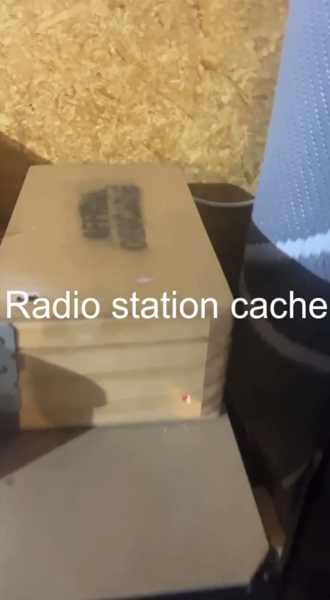

### BTS Of The F̸͖̏à̴̦ȕ̷̜l̷̡͋ṭ̷̔ỹ̸̳ Broadcast (Communication Series)

The mp3 player that sent audio over to the FM Transmitter was an old overkill Olympus audio player and recorder.
It has a backup battery in case of a power outage to keep the mp3 player active and not go to sleep. This does not power the transmitter.

The FM transmitter used was an old Aerpro AMPFMT35 Fm transmitter 4 channel. From memory, it was under 0.5W.

The transmitter is designed for a cigarette lighter port in a car but just ordered a cheap 240v to 12v converter and that did the trick!

I have a switch and speaker to preview the audio to show the mp3 player is working correctly. both of them were scrapped out of old electronics so didn't mind to add in.

The box containing the tech you will never get to see is a hand-crafted wooden box.

the whole project cost near to nothing as they were all laying around.

The current audio files are the old version files and I'm needing to replace them with more friendly files I have already edited. 

The music was done by me using sound loops in garage band many years ago (it really sucks)

### Updating with more Soon!
